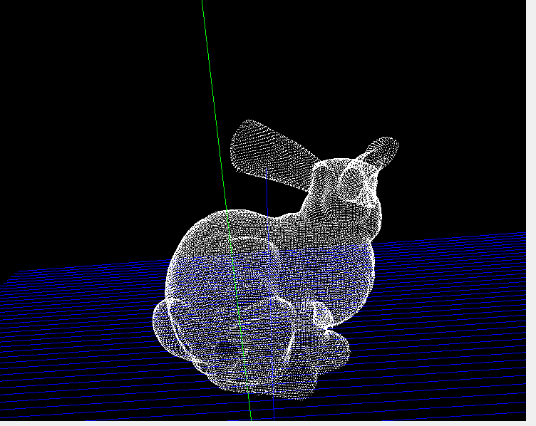

# 3D软件框架可行性方案1

### SharpGL&C# 方案分析

1. 前言

          界面框架使用c#，SharpGL为OpenGl在c#下的一个wrapper封装，主要作用是3D环境的渲染，纯显示点云。

2. 环境依赖配置

      本机使用vs2017，在工程引用中添加 `SharpGL.dll`  `SharpGL.WinForms.dll`  `SharpGL.SceneGraph.dll` 

      在界面设计的工具箱⇒设计⇒选择项中加入`SharpGL.WinForms.dll` ，在工具栏就会有新的四个项目，`OpenGLControl` 即为显示3D的窗口。

3. 几个易混淆接口

    ```cpp
    OpenGL gl = openGLControl.OpenGL;
    // 定义视野查看点
    gl.LookAt(double eyex, double eyey, double eyez, double centerx, double centery, double centerz, double upx, double upy, double upz);
    /*
    改变视点eyeX，可以实现在场景中横向移动
    改变视点eyeY，可以实现在场景中蹲下，跳起这样的动作
    改变视点Z分量eyeZ，能实现在场景中前后的动作
    对于摄像机目标点centerx,y,z 的变化，相当于观察者站着不动，但其观察方向在上下左右方向进行变化。

    第一组eyex, eyey,eyez 相机在世界坐标的位置
    第二组centerx,centery,centerz 相机镜头对准的物体在世界坐标的位置
    第三组upx,upy,upz 相机向上的方向在世界坐标中的方向
    你把相机想象成为你自己的脑袋：
    第一组数据就是脑袋的位置
    第二组数据就是眼睛看的物体的位置
    第三组就是头顶朝向的方向（因为你可以歪着头看同一个物体）
    */

    // 对视野的平移操作
    gl.Translate(nx, ny, nz);

    // 缩放比例
    gl.Scale(scaleN, scaleN, scaleN);

    // fovy视野在y方向的角度 aspect宽高比 zNear是近平面z坐标 zFar是远平面z坐标
    gl.Perspective(double fovy, double aspect, double zNear, double zFar)

    // LookAt()函数是通过移动照相机（使用试图变换）来观察这个立方体，而Translate()函数是通过移动茶壶（使用模型变换）。
    // 另外注意：视图变换要在模型变换之前进行。
    ```

4. 显示样例
    - demo

        

5. 参考与引用
    - 教程：[https://www.cnblogs.com/hackpig/tag/SharpGL/](https://www.cnblogs.com/hackpig/tag/SharpGL/)
    - GitHub参考：[https://github.com/dwmkerr/sharpgl](https://github.com/dwmkerr/sharpgl)
    - OpenGL理论内容： [learning openGL 中文教程](https://github.com/LearnOpenGL-CN/LearnOpenGL-CN)